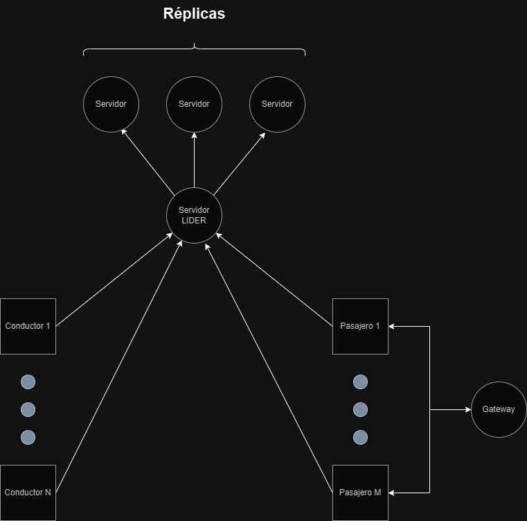
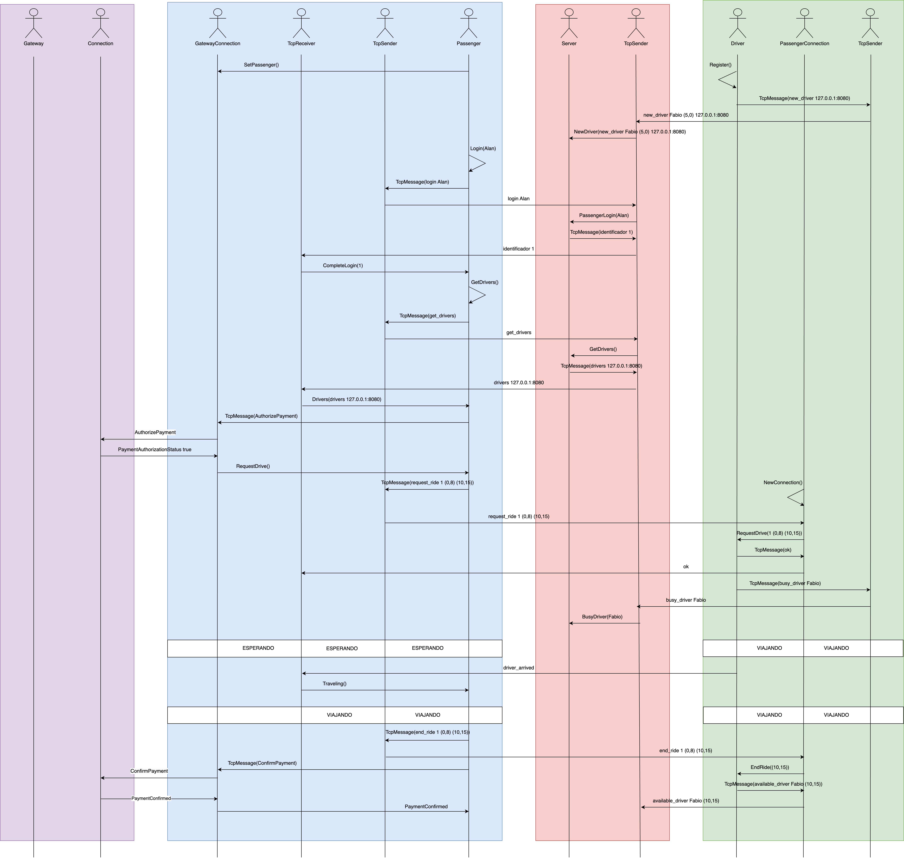
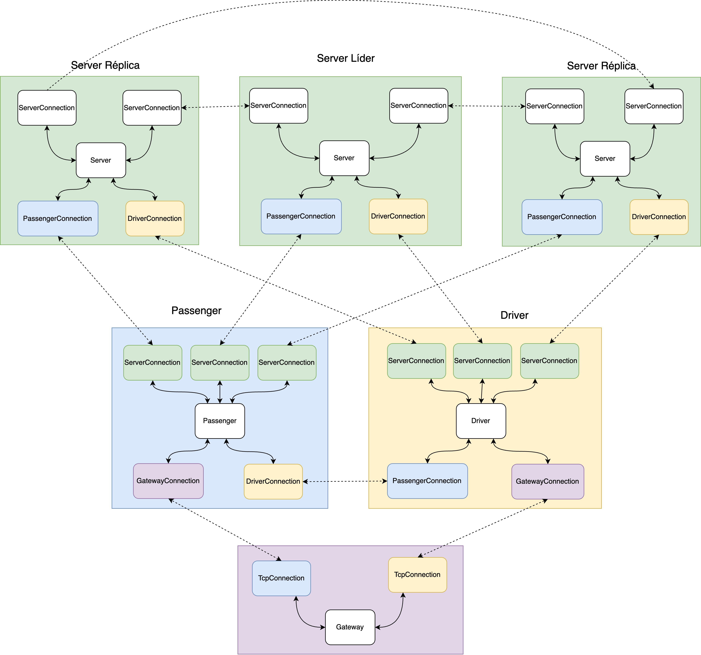
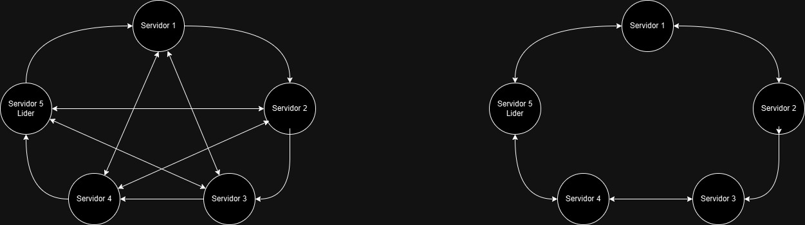
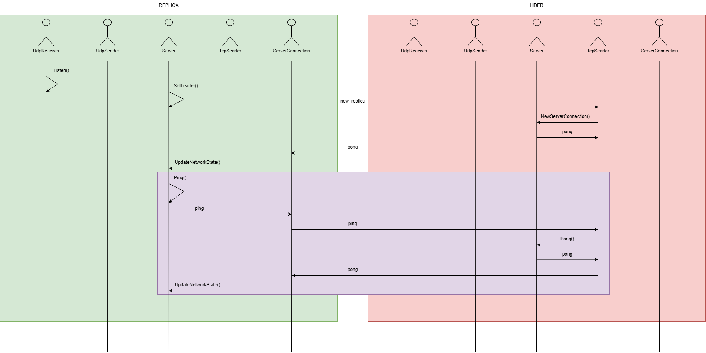
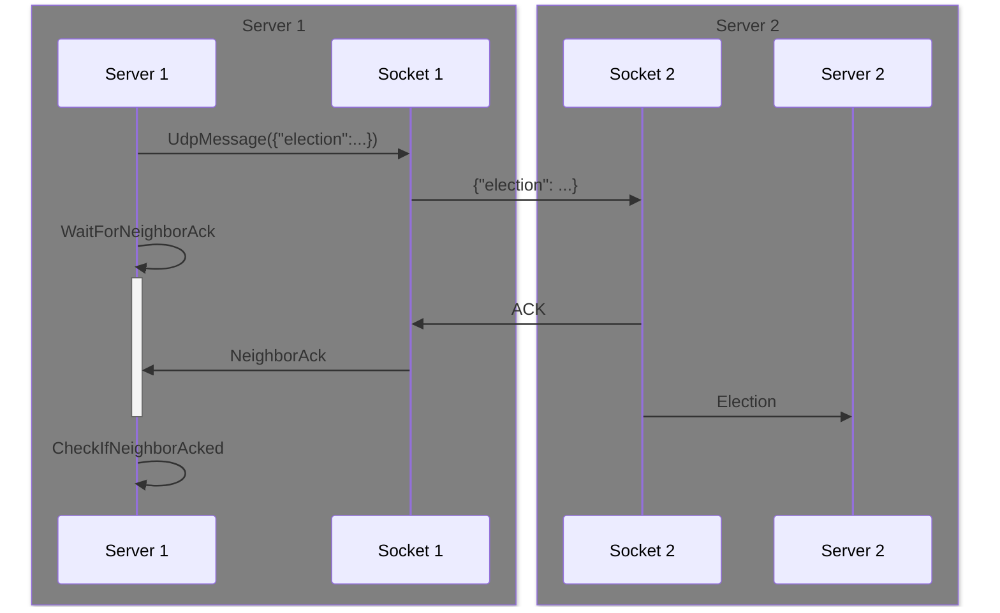
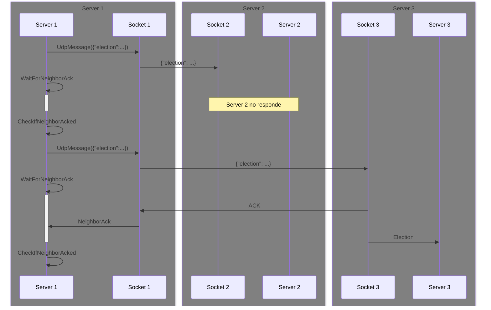
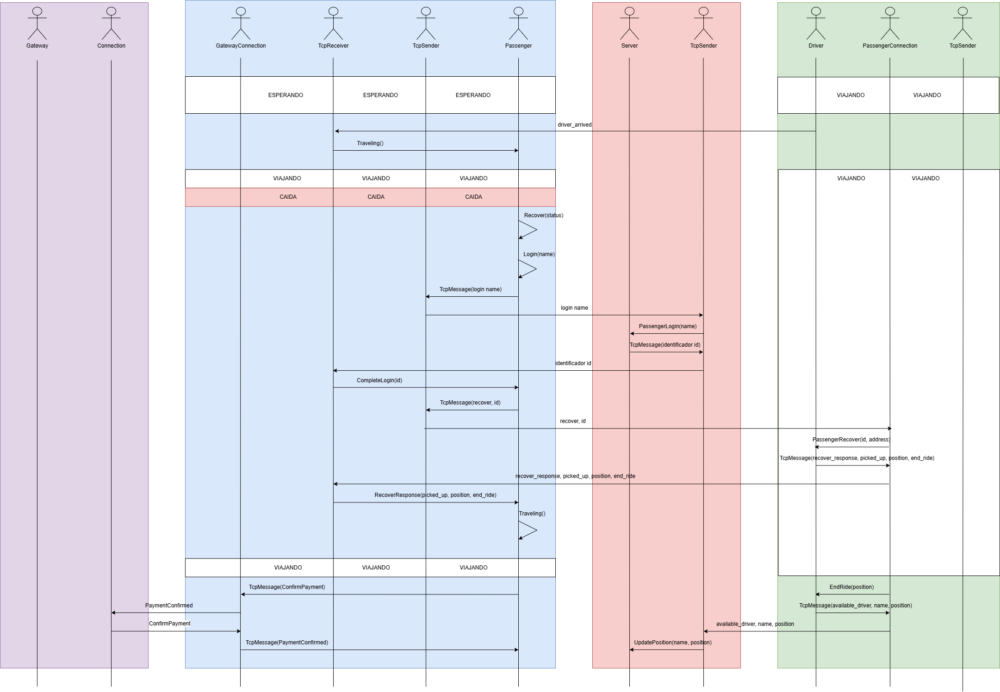
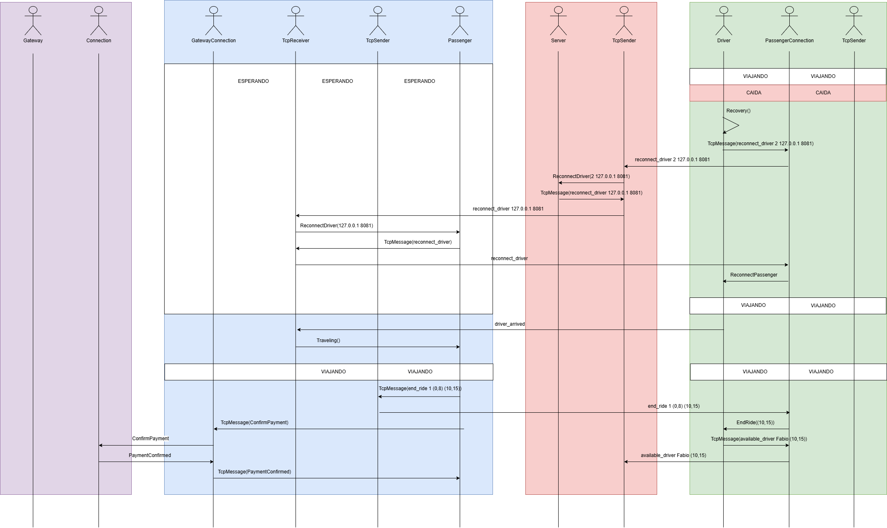

# ConcuRide

# Primer entrega: Diseño

## Diseño general

El sistema se compone de una estructura que incluye N servidores réplicas y un servidor líder, así como N pasajeros y M conductores.



El servidor actúa como un intermediario entre pasajeros y conductores, ya que en un principio estos no están conectados entre sí.
Para que los pasajeros y los conductores puedan conectarse entre sí, estos deben "declarar" su IP y puerto al servidor. Luego, el servidor comparte esta información con el resto de nodos de la red.

Cada pasajero y conductor se conecta inicialmente al servidor y al gateway para proceder con el proceso de inicio de sesión (logueo). 
Para iniciar el viaje, el pasajero solicita al servidor información sobre los conductores disponibles, y este le envía un listado de todos ellos. Una vez recibida la información, el pasajero selecciona al candidato más adecuado en función de la cercanía y se comunica directamente con el conductor para proceder con el viaje o, en su defecto, rechazarlo.

En caso de no encontrar un conductor en un determinado rango de distancia, dicho rango se ampliará con el objetivo de buscar conductores más lejanos hasta alcanzar un límite predefinido. Si no se encuentran conductores disponibles, el pasajero no podrá efectuar el viaje y deberá intentar nuevamente más tarde. El objetivo de seleccionar conductores según el rango de cercanía es optimizar el proceso de comunicación y asegurar que el pasajero solo se conecte con conductores cercanos.

Antes de que el viaje pueda realizarse, es necesaria una autorización a través del gateway. Una vez concluido el viaje, el conductor debe volver a comunicarse con el servidor para informar su nueva ubicación.

### Diagrama de secuencia

En el siguiente diagrama se puede visualizar qué mensajes se envían las distintas entidades para efectuar un viaje.



### Diagrama de actores

En el siguiente diagrama se pueden observar los distintos procesos del sistema, y los actores que componen a cada proceso.
A modo de ejemplo se muestran 3 servidores, 1 conductor, 1 pasajero y el gateway.

> [!NOTE]
> Los actores que se comunican entre sí mediante sockets están unidos por líneas punteadas, mientras que los que se comunican a través de mensajes de `actix` están unidos por líneas comunes.



### Replicación

Debido a que el servidor era un punto unico de falla (SPOF) decidimos agregar redundancia mediante réplicas. Es decir que toda la informacion que recibe el servidor lider, la distribuye entre sus replicas. De esta manera si el servidor lider pierde la conexion, se ejecutara el algoritmo "RING" para elegir el proximo lider. Para poder efectuarlo, todos los servidores estan conectados entre si. 

Para indicar las replicas de los servidores, se recibira como parametro un booleano indicando cual es el lider (true) y cuales son las replicas (false) al momento de ejecutar una instancia del servidor.

Los IDs de los servers deben estar entre 1 y 5, entonces cada servidor abrira un socket TCP en el puerto `10000 + ID` y un socket UDP en el puerto `5000 + ID`.

La comunicacion entre los servidores, se realizara mediante un actor, el cual almacenara todas las conexiones. Cada cierta cantidad de tiempo las replicas pediran un status al servidor lider, para chequear que continue conectado.



## Server APP

La aplicación `Server` está pensada para funcionar como un intermediario entre los pasajeros y los conductores.
La finalidad principal es informarle las direcciones de los conductores (IP y puerto) a los pasajeros, y trackear 
a los usuarios (pasajeros y conductores) que están conectados a la red.

La aplicación está diseñada siguiendo el modelo de actores y se compone por cuatro actores:
1. `Server` [[server.rs](server/src/server.rs)]
2. `TcpSender` [[sender.rs](server/src/sender.rs)]
3. `ServerConnection` [[server_connection.rs](server/src/server_connection.rs)]
4. `UdpReceiver` [[udp_receiver.rs](server/src/udp_receiver.rs)]
4. `UdpSender` [[udp_sender.rs](server/src/udp_sender.rs)]
4. `ConnectionListener` [[connection_listener.rs](server/src/connection_listener.rs)]

### Server

<details>
  <summary>Finalidad</summary>
El actor `Server` mantiene y broadcastea información sobre los usuarios conectados a la red (pasajeros y conductores).

Puede ser un servidor lider o un servidor replica.
</details>

<details>
  <summary>Estado interno</summary>

```rs
pub struct Server {
    /// ID del server
    pub id: u64,
    /// ID del server lider
    pub id_leader: u64,
    /// Booleano indicando si es líder
    pub im_leader: bool,
    /// Drivers disponibles segun su nombre
    /// El server envía esta información a los pasajeros
    pub drivers: HashMap<String, DriverInfo>,
    /// Drivers ocupados segun su nombre
    pub busy_drivers: HashMap<String, DriverInfo>,
    /// ID de pasajeros segun su nombre
    pub passengers: HashMap<String, u64>,
    /// Conexiones con pasajeros segun sus IDs
    pub passengers_address: HashMap<u64, Addr<TcpSender>>,
    /// Sockets de servidores replicas
    pub udp_sockets_replicas: HashMap<u64, String>,
    /// Conexiones con servers segun su ID
    pub servers: HashMap<u64, Addr<TcpSender>>,
    /// Contador de IDs
    pub ids_count: u64,
    /// Sender UDP
    pub udp_sender: Option<Addr<UdpSender>>,
    /// Conexion con el lider. Es None en caso de ser el lider.
    pub leader_connection: Option<Addr<ServerConnection>>,
    /// Listado de servers desconectados
    pub disconnected_servers: Vec<u64>,
    /// Booleano indicando si se recibio el ACK del vecino
    pub received_neighbor_ack: bool,
    /// Booleano indicando si hay una eleccion de lider en curso
    pub election_on_course: bool,
    /// ID del vecino actual
    pub actual_neighbor_id: u64,
    /// Numero de secuencia actual
    pub sequence_number: u64,
    /// Booleano que indica si se recibio ACK para un numero de secuencia
    pub message_received_ack: HashMap<u64, bool>,
}
```
</details>


<details>
  <summary id="server-recv">Mensajes que recibe</summary>

El `Server` recibe mensajes desde el actor `TcpSender`. Sin embargo, estos mensajes corresponden a los mensajes TCP que envían
los pasajeros y los conductores, el actor `TcpSender` simplemente los deserializa y se los transmite al `Server`.

De los mensajes que recibe de `TcpSender`, los siguientes corresponden a mensajes que son enviados por el conductor.

```rs
/// Luego de que el Driver se haya conectado, se recibe este mensaje para identificarlo como driver
/// En el se recibe el nombre del driver (identificador). En caso de que el driver no este registrado
/// lo registra y lo guarda en la lista de drivers disponibes
struct NewDriver {
    /// IP y puerto del conductor
    socket: String,
    /// Nombre del conductor (para identificarlo)
    name: String,
    /// Ubicación actual del conductor
    position: (u64 u64),
}
```

> [!NOTE]
> Si el server recibe el mensaje `NewDriver` de un conductor que se ha registrado previamente, entonces se trata de una reconexión, es decir, el conductor sufrió una desconexión y está intentando reconectarse.


```rs
/// El conductor envia este mensaje para informarle al Server que está ocupado (en viaje con un pasajero).
/// Al recibir este mensaje, el Server marca al conductor como ocupado (lo elimina del hashmap con los 
/// conductores disponibles, y lo agrega al hashmap de conductores ocupados).
/// De esta forma, el Server va a enviarle a los pasajeros sólo aquellos conductores que estén disponibles.
struct BusyDriver {
    name: String,
}
```

```rs
/// El conductor envía este mensaje al Server cuando está disponible.
/// Al recibir este mensaje, el Server marca al conductor como disponible, y actualiza
/// su ubicación en el hashmap de conductores disponibles.
struct AvailableDriver {
    name: String,
    /// La ubicación actualizada del conductor.
    new_position: (u64, u64),
}
```

```rs
pub struct UpdateDriver {
    pub new_position: (u64, u64),
    pub name: String,
}
```

```rs
pub struct ReconnectDriver {
    pub id_passenger: u64,
    pub socket: String,
    pub name: String,
}
```

```rs
pub struct UpdateDriverSocket {
    pub socket: String,
    pub name: String,
}
```

De los mensajes que recibe de `TcpSender`, los siguientes corresponden a mensajes que son enviados por el pasajero.

```rs
/// Representa el "registro" de un pasajero en la red.
/// El Server se guarda el `name` del pasajero, le asocia un id y le manda un mensaje informándole su id.
struct PassengerLogin {
   name: String, 
}
```

> [!NOTE]
> Si el server recibe el mensaje `PassengerLogin` de un pasajero que se ha logeado previamente, entonces se trata de una reconexión, es decir, el pasajero sufrió una desconexión y está intentando reconectarse.

```rs
/// El pasajero le pide la información de los conductores al Server.
/// El Server le responde con el mensaje `Drivers`, que contiene 
/// información del conductor (IP, puerto, ubicación, etc).
struct GetDrivers {}
```

De los mensajes que recibe de `TcpSender`, los siguientes corresponden a mensajes relacionados a los servidores replica.

```rs
pub struct NewServerConnection {
    /// Address del actor TcpSender
    pub addr: Addr<TcpSender>,
    /// Socket de la conexión (IP y puerto).
    pub socket: String,
    /// Id de la conexión.
    pub id: u64,
}
```

```rs
pub struct Ping {}
```

```rs
pub struct Pong {
    pub addr: Addr<TcpSender>,
}
```

```rs
pub struct UpdateNetworkState {
    /// Contador de ids
    pub ids_count: u64,
    /// Un hashmap con los conductores disponibles.
    pub drivers: HashMap<String, DriverInfo>,
    /// Un hashmap con los conductores ocupados.
    pub busy_drivers: HashMap<String, DriverInfo>,
    /// Un hashmap que mapea el nombre del pasajero a un id
    pub passengers: HashMap<String, u64>,
    /// Sockets UDP de servidores replica segun el id
    pub udp_sockets_replicas: HashMap<u64, String>,
    /// Vector con los ids de los servidores que estan desconectados
    pub disconnected_servers: Vec<u64>,
}
```

```rs
pub struct SetLeader {
    pub leader_connection: Addr<ServerConnection>,
}
```

```rs
pub struct StartElection {}
```

```rs
pub struct WaitForNeighborAck {
    /// Mensaje que envíe a la réplica
    pub serialized_msg: String,
    /// ID de la réplica
    pub neighbor_id: u64,
    /// Numero de secuencia del mensaje
    pub sequence_number: u64,
}
```

```rs
pub struct CheckIfNeighborAcked {
    /// ID de la réplica a quien le envíe un mensaje
    pub neighbor_id: u64,
    /// Mensaje que envié
    pub serialized_msg: String,
    /// Numero de secuencia.
    pub sequence_number: u64,
}
```

```rs
pub struct Election {
    /// ID del líder que se cayó.
    pub disconnected_leader_id: u64,
    /// Listado de IDs de servidores réplicas conectados
    pub server_ids: Vec<u64>,
    /// Número de secuencia del mensaje.
    pub sequence_number: u64,
}
```

```rs
pub struct NewLeader {
    /// ID del server que determinó el nuevo líder.
    pub id_sender: u64,
    /// ID del nuevo líder.
    pub leader_id: u64,
    /// Número de secuencia.
    pub sequence_number: u64,
}
```

```rs
pub struct NeighborAck {
    /// ID de la réplica
    pub id: u64,
    /// Mensaje al cual corresponde el ACK
    pub message: String,
    /// Numero de secuencia
    pub sequence_number: u64,
}
```

```rs
pub struct ConnectToServer {}
```

</details>

<details>
  <summary>Mensajes que envía</summary>

```rs
pub struct TcpMessage(pub String);
```

El `Server` envía el mensaje `TcpMessage` al actor `TcpSender`. Su funcion es enviar el mensaje TCP al otro extremo del socket, es decir, simplemente serializa y reenvia el mensaje a quien corresponda a través del socket. El receptor final de estos mensajes pueden ser conductores, pasajeros o servidores replica.

</details>

<details>
  <summary id="msg-server-lider-replicas">Mensajes entre el servidor líder y las réplicas</summary>

Los servidores se comunican entre sí a través de los actores [ServerConnection](#serverconnection).

Periódicamente el servidor líder envía a los servidores réplicas un mensaje con el estado actual de la red, es decir, la información actual de todos los conductores y pasajeros.
Para ello envía en el payload de cierto mensaje la siguiente informacion:

```rs
pub struct UpdateNetworkState {
    /// Contador de ids
    pub ids_count: u64,
    /// Un hashmap con los conductores disponibles.
    pub drivers: HashMap<String, DriverInfo>,
    /// Un hashmap con los conductores ocupados.
    pub busy_drivers: HashMap<String, DriverInfo>,
    /// Un hashmap que mapea el nombre del pasajero a un id
    pub passengers: HashMap<String, u64>,
    /// Sockets UDP de servidores replica segun el id
    pub udp_sockets_replicas: HashMap<u64, String>,
    /// Vector con los ids de los servidores que estan desconectados
    pub disconnected_servers: Vec<u64>,
}
```

Para comprobar que el servidor líder sigue conectado, los servidores réplicas le envían un mensaje `Ping`, al cual el servidor líder responde con `Pong` que contiene en su payload la informacion mencionada anteriormente. En caso de que el servidor líder no responda, se inicia el algoritmo de elección de líder. En este caso utilizamos el algoritmo de tipo RING.

En el siguiente diagrama se puede visualizar el intercambio de mensajes que ocurre entre los servidores réplicas y el servidor lider, teniendo en cuenta todo lo mencionado anteriormente:



Dtalles adicionales:
1. Inicialmente cuando una replica se conecta se da inicio al actor UdpReceiver mediante el mensaje Listen.
2. Al momento de conectarse al servidor lider la replica le envia 'new_replica' por medio de la conexion TCP.
3. En el mensaje NewServerConnection se guarda la nueva conexion y se broadcastea mediante `Pong` el nuevo estado de la red no solo a la replica que acaba de conectarse, sino para todas las que se hayan conectado previamente para que se enteren de la nueva replica conectada.

</details>

<details>
  <summary id="msg-servers-replicas">Mensajes de elección de líder</summary>

Los servidores réplicas se comunican entre sí para elegir un nuevo líder, en caso de que el líder actual se haya caído.
Cuando el líder se cae, las réplicas pueden detectarlo dado que periódicamente le mandan un mensaje `Ping` para corroborar que siga conectado.
Si el líder no responde, se deduce que está caído.

Cuando un servidor réplica (el coordinador) detecta que el líder está caído, envía el mensaje `Election` al servidor réplica "vecino".
El mensaje `Election` contiene como payload un listado con los IDs de los servidores réplica. Cada vez que un servidor recibe este mensaje, agrega su ID al listado, y lo reenvía a su vecino siguiente.

Cuando el mensaje `Election` llega al coordinador, éste selecciona como líder al servidor con el mayor ID. Luego, envía al resto de servidores el mensaje `Leader` que contiene el id del nuevo líder.

Por otro lado, para que el algoritmo de elección de líder funcione incluso cuando algunas réplicas están caídas (además del líder) lo que se hace es, cada vez que se envía un mensaje del algoritmo (`Election`, NewLeader) a un vecino, se espera por un ACK del mensaje. Si no se recibe un ACK luego de pasado cierto tiempo, se asume que el vecino está caído y se reenvia el mismo mensaje pero al vecino siguiente.

Mencionamos primero que el mensaje `WaitForNeighborAck` se lo envia el server a si mismo luego de mandarle un mensaje del algoritmo (Election, NewLeader) a un vecino. El handler de este mensaje simplemente duerme un cierto tiempo y luego se envia a si mismo el mensaje `CheckIfNeighborAcked`.

El mensaje `CheckIfNeighborAcked` lo que hace es chequear si se recibió un ACK de un mensaje en particular. Si no se recibió un ACK, se reenvía el mensaje al siguiente vecino.

Por ultimo, el mensaje `NeighborAck` se lo manda el `UdpReceiver`. El mensaje contiene el numero de secuencia del mensaje al cual corresponde el ACK. En el handler, el server marca ese mensaje como "ackeado" (le pone true en un hashmap con numeros de secuencia).

La idea es que luego de mandar un mensaje, el server reciba `NeighborAck` antes que `CheckIfNeighborAcked`, de forma que para cuando entra al handler de `CheckIfNeighborAcked`, el mensaje ya está marcado como "ackeado".

En un caso feliz donde el vecino está conectado y responde los mensajes, el flujo sería este.



Por otro lado, si el server 2 está caído y no responde ACKs, el flujo sería el siguiente.
Dado que no se recibe ACK del server 2, se asume que está caído y en su lugar se reenvía el mensaje pero al server 3.
Notar que el Server 1 no recibe ningún `NeighborAck` antes del primer `CheckIfNeighborAcked`, lo cual hace que se reenvie el mensaje al siguiente vecino.



Notamos que la comunicacion entre los servidores replicas al momento de elegir un lider es mediante UDP. Esta decision de diseño fue principalmente para evitar tener que establecer una conexion entre cada replica.

</details>


<details>
  <summary>Protocolos</summary>

La aplicación `Server` se comunica con las otras entidades mediante conexiones TCP.
Los mensajes del protocolo de aplicación son simplemente strings JSON que contienen los campos de los `actix::Message`.
Por ejemplo, para el mensaje `Id`, se envía el siguiente string JSON

```json
{"name": "id", "payload": {"id": "11"}}
```

Donde `name` corresponde al nombre del mensaje, el cual se usa para determinar el tipo de mensaje.

</details>

### TcpSender
<details>
  <summary>Finalidad</summary>

El actor `TcpSender` representa una conexión TCP con un usuario de la red, que puede ser un pasajero o un conductor,
es decir, habrá una instancia de `TcpSender` por cada usuario conectado al Server.
Su finalidad principal es:
* Escuchar mensajes TCP, deserializarlos y forwardeárselos a `Server` como un `actix::Message`.
* Forwardear los mensajes de `Server` a través de un mensaje TCP al receptor correspondiente.

</details>

<details>
  <summary>Estado interno</summary>

```rs
struct TcpSender {
    /// El extremo de escritura del socket
    write: WriteHalf<TcpStream>,
    /// El address del actor `Server`, para forwardearle los mensajes
    server_addr: Addr<Server>,
}
```

</details>

<details>
  <summary>Mensajes que recibe</summary>

`TcpSender` recibe mensajes `TcpMessage` de `Server`, los serializa y los envía por el socket.

```rs
struct TcpMessage {
    /// Un string JSON que contiene los campos del mensaje original
    msg: String
}
```

También recibe mensajes de los usuarios a través del socket, los cuales deserializa en un `actix::Message` y se los envía a `Server`.
Cada uno de estos mensajes está detallado en la sección [Mensajes que recibe](#server-recv) de `Server`.

</details>

### ServerConnection

<details>
  <summary>Finalidad</summary>

El actor `ServerConnection` representa una conexión con otro servidor.
Dado que todos los servidores están conectados entre sí, cada uno de ellos tendrá una instancia de `ServerConnection` por cada conexión con otro servidor.

</details>

<details>
  <summary>Estado interno</summary>

```rs
pub struct ServerConnection {
    /// Address del server
    pub addr: Addr<Server>,
    /// Extremo de escritura del socket
    pub write: Option<WriteHalf<TcpStream>>,
    /// Tiempo de respuesta luego del cual se considera caido el server lider
    pub response_time: Instant,
}
```

</details>

<details>
  <summary>Mensajes que recibe</summary>

El actor `ServerConnection` recibe mensajes `TcpMessage` de `Server`.

Su funcion es enviar el mensaje TCP al otro extremo del socket, es decir, simplemente serializa y reenvia el mensaje al usuario correspondiente a través del socket.

```rs
struct TcpMessage {
    /// Un string JSON que contiene los campos del mensaje original
    msg: String
}
```

</details>

<details>
    <summary>Mensajes que envia</summary>

También recibe mensajes de los otros servidores a través del socket, los cuales deserializa en un `actix::Message` y se los envía a `Server`.

Cada uno de estos mensajes está detallado en la sección [Mensajes entre el servidor líder y las réplicas](#msg-server-lider-replicas) de `Server`.

</details>

### UdpReceiver
<details>
  <summary>Finalidad</summary>
  Representa un actor que recibe mensajes UDP a traves de un socket
</details>

<details>
  <summary>Estado interno</summary>

```rs
pub struct UdpReceiver {
    /// Socket UDP
    pub socket: Arc<UdpSocket>,
    /// Address del actor socket
    pub server: Option<Addr<Server>>,
}
```

</details>

<details>
  <summary>Mensajes que recibe</summary>

```rs
/// Escucha mensajes UDP, los deserializa y envia el respectivo mensaje de actix al server.
pub struct Listen {}
```

</details>

### UdpSender
<details>
  <summary>Finalidad</summary>
  Representa un actor que envia mensajes UDP.
</details>

<details>
  <summary>Estado interno</summary>

```rs
pub struct UdpSender {
    pub socket: Arc<UdpSocket>,
}
```

</details>

<details>
  <summary>Mensajes que recibe</summary>

```rs
/// Representa un mensaje UDP, con el contenido y el destino.
pub struct UdpMessage {
    pub message: String,
    pub dst: String,
}
```

</details>

### ConnectionListener
<details>
  <summary>Finalidad</summary>
  Representa un actor que escucha por conexiones TCP.
</details>

<details>
  <summary>Estado interno</summary>

```rs
pub struct ConnectionListener {
    /// Socket en el cual escucha conexiones
    pub socket: String,
    /// Address del actor Server
    pub server_addr: Addr<Server>,
}
```

</details>

<details>
  <summary>Mensajes que recibe</summary>

```rs
  /// Escucha por conexiones TCP.
  pub struct Listen {}
```

</details>

## Passenger APP

La aplicacion que modela al pasajero se compone por cuatro actores:
1. `Passenger` [[passenger.rs](passenger/src/passenger.rs)]: Su finalidad es modelar al pasajero.
2. `TcpSender` [[sender.rs](passenger/src/sender.rs)]: Su finalidad es modelar el extremo de escritura del socket.
3. `TcpReceiver` [[receiver.rs](passenger/src/receiver.rs)]: Su finalidad es modelar el extremo de lectura del socket.
4. `GatewayConnection` [[gateway_connection.rs](passenger/src/gateway_connection.rs)]:  Su finalidad es modelar la conexion con el Gateway. Modela tanto el extremo de escritura como el extremo de lectura del socket.

### Passenger

<details>
  <summary>Finalidad</summary>

La finalidad de este actor es modelar cada pasajero de la aplicacion.

</details>

<details>

<summary>Estado interno</summary>

```rs
pub struct Passenger {
    /// Nombre del pasajero
    pub name: String,
    /// Informacion del pasajero
    pub info: PassengerInfo,
    /// Booleano de recuperacion en caso de caida
    pub recovery: bool,
    /// Booleano del estado de la autorizacion
    pub payment_authorized: bool,
    /// Booleano del estado del pago
    pub payment_confirmed: bool,
    /// Comunicacion con el servidor
    pub server_receiver: Option<Addr<TcpReceiver>>,
    /// Comunicacion con el servidor
    pub server_sender: Addr<TcpSender>,
    /// Conexiones
    pub connections: Vec<Addr<TcpSender>>,
    // Informacion de los conductores que recibe del servidor
    pub drivers_info: Vec<DriverInfo>,
    /// Socket del conductor seleccionado
    pub driver_socket: Option<String>,
    // Comunicacion con el Gateway
    pub gateway: Addr<GatewayConnection>,
}
```

```rs
struct PassengerInfo {
    /// ID del pasajero asignado por el servidor
    pub id: usize,
    /// Posicion origen
    pub position: (u64, u64),
    /// Posicion destino
    pub destination: (u64, u64),
}
```

```rs
struct DriverInfo {
    /// Socket del conductor
    pub socket: String,
    /// Posicion origen
    pub position: (u64, u64),
}
```

</details>

<details>

<summary>Mensajes que recibe</summary>

```rs
// Se utiliza para almacenar la direccion del actor TcpReceiver que se utiliza para comunicarse con el servidor
  pub struct SetReceiver {
      /// Comunicacion con el servidor. Direccion del actor TcpReceiver.
      pub receiver: Addr<TcpReceiver>,
  }
```

```rs

/// Solicita al servidor los conductores disponibles para poder comunicarse con ellos y concretar el viaje. Luego de enviar el mensaje valida que la conexion con el servidor exista, en caso de que se haya perdido la conexion se reconecta con el nuevo lider y reenvia el mensaje para no perder informacion.
  struct GetDrivers {}
```

```rs

/// Selecciona un conductor segun la cercania y se comunica con el Gateway para solicitar autorizacion para realizar el viaje. Almacena la conexion con el conductor seleccionado. En caso de existir algun tipo de error, vuelve a intentar seleccionar otro conductor.
  struct Drivers {
      // Informacion de los conductores
      pub drivers_info: Vec<DriverInfo>,
  }
```

```rs
/// Se loguea en el servidor, registrandose con su nombre. Si la conexion esta caida, se conecta con el nuevo lider.
  struct Login {
      /// Nombre del pasajero
      pub name: String,
  }
```

```rs

/// Se encarga de actualizar la posicion del pasajero simulando el viaje. Una vez que llega a destino finaliza el viaje y le solicita la confirmacion del pago al Gateway.
  pub struct Traveling {}
```

```rs
/// Indica que el conductor se encuentra en el lugar de partida, listo para comenzar el viaje. Inicia el viaje.
pub struct DriverArrived {}
```

```rs
/// Recibe del servidor el ID con el cual se identifica en el servidor y lo guarda
    struct CompleteLogin {
        /// ID del pasajero asignado por el servidor
        pub id: usize,
    }
```

```rs
/// Indica que el conductor acepto el viaje. Luego espera a que el conductor le notifique que llego al punto de partida.
pub struct RideAccepted {}
```

```rs
/// Solicita al conductor un viaje a un destino en particular
    struct RequestDrive {}
```

```rs
/// En caso de que el conductor rechace el viaje, vuelve a iniciar otra busqueda
    struct KeepLooking {}
```

```rs
/// Indica que el pago fue autorizado por el Gateway actualizando el estado
pub struct PaymentAuthorized {}
```

```rs
// El pago fue denegado por el Gateway, comienzo nuevamente la busqueda por un conductor
pub struct PaymentDeny {}
```

```rs
/// Luego de identificar la perdida de conexion y que el conductor se encontraba en viaje, recibe el estado del mismo de parte del conductor
pub struct RecoverResponse {
    /// Booleano que indica si el conductor levanto al pasajero
    pub picked_up: bool,
    /// Posicion actual del conductor
    pub position: (u64, u64),
    /// Booleano que indica si el viaje finalizo
    pub end_ride: bool,
}
```

```rs
/// En caso de que se pierda la conexion con el servidor lider, intenta reconectarse al nuevo lider. Se reconecta y almacena todos los caneles de comunicacion con el servidor lider, luego le reenvia el mensaje que no pudo enviarse debido a la caida del mismo
pub struct Reconnect {
    /// Mensaje serializado que debe reenviarse
    pub serialized_msg: String,
}
```

```rs
/// Recibe del servidor la notificacion de que el conductor se reconecto y se intenta reconectar al conductor. Si es posible se almacena la conexion y envia al conductor un mensaje que indica el intento de reconexion. En caso contrario notifica que hay un error.
pub struct ReconnectDriver {
    /// Socket del conductor caido
    pub socket: String,
}
```

```rs
/// Dado que perdimos la conexion, restauramos nuestro estado utilizando el archivo correspondiente.
/// Si el pago habia sido confirmado, entonces indica que el viaje termino.
/// Si el pago no fue autorizado, entonces indica que no estoy en viaje ni solicitando uno.
/// Caso contrario, si tengo un conductor asignado, entonces estoy en viaje y le solicito el estado del mismo.
pub struct Recover {
    /// Estado leìdo del archivo corrrespondiente
    pub status: Value,
}
```

</details>

<details>

<summary>Mensajes que envia</summary>

```rs
pub struct TcpMessage(pub String);
```

El actor `Passenger` envía el mensaje `TcpMessage` al actor `TcpSender`. Su funcion es enviar el mensaje TCP al otro extremo del socket, es decir, simplemente serializa y reenvia el mensaje a quien corresponda a través del socket.

### Mensajes enviados al servidor

1. Envia el mensaje `Login` al servidor líder. El payload del mensaje contiene el nombre del pasajero para que de esta forma sea identificado en el servidor.

2. Envia el mensaje `GetDrivers` al servidor líder. El payload del mensaje contiene el ID del pasajero para que de esta forma sea identificado en el servidor y el servidor sepa a quien enviarle los conductores.

### Mensajes enviados al conductor

1. Envia el mensaje `RequestRide` al conductor. El payload del mensaje contiene el ID del pasajero, la ubicacion origen y la ubicacion destino.

2. Envia el mensaje `EndRide` al conductor. El payload del mensaje contiene el ID del pasajero, la ubicacion origen y la ubicacion destino. 

3. Envia el mensaje `ReconnectDriver` al conductor luego de una caida para que de esta forma el conductor se entere de que el pasajero volvio a reconectarse y guarde su dirreccion.

### Mensajes enviados al Gateway

1. Envia el mensaje `AuthorizePayment` al gateway.

### Mensajes recursivos

1. Se auto-envia el mensaje `Drivers` en dos situaciones:
    - Dentro del mismo mensaje `Drivers` caso de que haya un error al momento de conectarse al conductor seleccionado
    - Dentro del mensaje `KeepLooking` en caso de que el conductor seleccionado lo rechace, para intentar conectarse a otro conductor

2. Se auto-envia el mensaje `Traveling` dentro del mensaje `RecoverResponse` luego de reconectarse tras una caida en caso de que continue en viaje a su destino

</details>

<details>

<summary>Casos de interes</summary>

### Rechazo de solicitud

En caso de que un conductor rechace la solicitud de viaje de un pasajero o haya un error
en la conexion, no sera tenido en cuenta la proxima vez que el pasajero intente seleccionar un conductor

### Caídas

Los pasajeros pueden recuperar su estado ante caídas.

El estado del pasajero se escribe en ciertos momentos de su ejecucion en un archivo. Para ser exactos, la siguiente informacion es la que se escribe:
1. Lista de conductores
2. Socket del conductor elegido
3. Estado de la autorizacion
4. Estado del pago
5. ID asociado

Al momento volver a ejecutar un pasajero se debe indicar mediante un flag que se necesita recuperar la informacion del estado previo a la caida.

Luego, en el momento en que un pasajero se conecta y se indica el flag de recuperacion se inicia el proceso de lectura del archivo con su estado y se actualiza.

La caída del pasajero puede suceder en las siguientes situaciones:
1. **El pasajero se cae mientras no está viajando**: En este caso, al reconectarse simplemente continúa buscando un conductor.
2. **El pasajero se cae cuando el conductor esta yendo a buscarlo**: 
3. **El pasajero se cae mientras está viajando**: en este caso se reanuda la conexión con el conductor y se continúa el viaje.
4. **El pasajero se cae despues de que el Gateway le rechaza la autorizacion del pago**

En la situacion (3), al momento de re-conectarse se valida si el archivo escrito posee informacion del socket del conductor elegido lo cual nos indica si estaba asociado a un conductor. Si se tiene informacion, se re-conecta al conductor y se le envia el mensaje `Recover` para solicitarle al conductor informacion del estado. 

El conductor le envia un booleano indicando si se encuentra en viaje o no y tambien su posicion.

Cuando el pasajero recibe esta informacion, actualiza su estado y se auto-envia el mensaje `Traveling`.

A continuacion, se muestra en un diagrama de secuencia el escenario (3):



</details>

### TcpSender

<details>
  <summary>Finalidad</summary>

  Gestiona la escritura asíncronica en una conexión TCP.
Extrae el mensaje recibido y escribe el contenido en la conexión.

</details>

<details>
  <summary>Estado interno</summary>

  ```rs
    pub struct TcpSender {
      /// Escritura asíncrona en la conexión TCP
      pub write: Option<WriteHalf<TcpStream>>,
      /// Dirección de socket asociada
      pub addr: SocketAddr,
  }
  ```

</details>

<details>
  <summary>Mensajes que envia</summary>

  No envia mensajes a otros actores.

</details>

<details>
  <summary>Mensajes que recibe</summary>

```rs
/// Envia al servidor el contenido del mensaje recibido
struct TcpMessage(pub String);
```

</details>

### TcpReceiver

<details>
  <summary>Finalidad</summary>

  Su finalidad es modelar el extremo de lectura del socket.

</details>

<details>
  <summary>Estado interno</summary>

  ```rs
    pub struct TcpReceiver {
      /// Dirección de socket asociada
      pub addr: SocketAddr,
      /// Direccion del actor del pasajero
      pub client_addr: Addr<Passenger>,
  }
  ```

</details>

<details>
  <summary>Mensajes que envia</summary>

```rs
    struct Drivers {
        pub drivers_info: Vec<DriverInfo>,
    }
```

```rs
    struct CompleteLogin {
        pub id: usize,
    }
```

```rs
    struct RideAccepted {
      pub driver_socket: String,
    }
```

```rs
    struct DriverArrived {}
```


```rs
    struct KeepLooking {}
```

```rs
    struct RecoverResponse {
      /// Booleano que indica si el conductor levanto al pasajero
      pub picked_up: bool,
      /// Posicion actual del conductor
      pub position: (u64, u64),
      /// Booleano que indica si el viaje finalizo
      pub end_ride: bool,
    }
```

```rs
    struct ReconnectDriver {
      /// Socket del conductor caido
      pub socket: String,
    }
```

</details>

<details>
  <summary>Mensajes que recibe</summary>

  No recibe mensajes de otros actores.

</details>

### GatewayConnection

<details>
  <summary>Finalidad</summary>

  Su finalidad es modelar la conexion con el Gateway. Modela tanto el extremo de escritura como el extremo de lectura del socket.

</details>

<details>
  <summary>Estado interno</summary>

```rs
  pub struct GatewayConnection {
      // Direccion del actor del pasajero
      pub passenger: Option<Addr<Passenger>>,
      /// Escritura asíncrona en la conexión TCP
      pub write: Option<WriteHalf<TcpStream>>,
  }
```

</details>

<details>
  <summary>Mensajes que envia</summary>

  ```rs
    struct PaymentAuthorized {}
```

```rs
    struct RequestDrive {}
```

</details>

<details>
  <summary>Mensajes que recibe</summary>

```rs
/// Recibe este mensaje cuando el pago fue autorizado por el Gateway
    struct AuthorizePayment {}
```

```rs
/// Almacena al actor pasajero dentro del actor que representa la conexion con el Gateway
pub struct SetPassenger {
    // Direccion del actor del pasajero
    pub passenger: Addr<Passenger>,
}
```

```rs
/// Envia al actor Gateway el contenido del mensaje recibido
    pub struct TcpMessage(pub String);
```


</details>

## Driver APP

### Driver

<details>
  <summary>Estado interno</summary>

```rs
pub struct Driver {
    pub server_receiver: Option<Addr<TcpReceiver>>,// direccion para recibir mensajes del servidor lider
    pub server_sender: Addr<TcpSender>,// Dirección para enviar mensajes al servidor líder.
    pub connections: Vec<Addr<PassengerConnection>>,// Lista de conexiones con los pasajeros.
    pub id_current_passenger: usize, // ID del pasajero actual.
    pub is_available: bool, // Indica si el conductor está disponible.
    pub is_registered: bool, // Indica si el conductor esta registrado en el servidor
    pub position: (u64, u64), // Posición actual del conductor
    pub passenger_position: Option<(u64, u64)>, // Posición del pasajero
    pub destination: Option<(u64, u64)>, // Destino actual (si existe).
    pub name: String,  // Nombre del conductor.
    pub current_passenger_connection: Option<Addr<PassengerConnection>>, // Almacena el canal de comunicacion con el pasajero
    pub passenger_picked_up: bool, // indica si el conductor recogio al pasajero
    pub driver_socket: String, // Almacena la direccion IP del socket de conductor
}
```

</details>

<details>
  <summary>Finalidad</summary>

Se modelo la entidad Driver debido a que nos encontramos en la app del conductor.
Esta entidad se encarga de almacenar la coneccion con el servidor para comunicarse, almacenar las distintas conecciones recibidas con los pasajeros y comunicarse con ellos, aceptando o rechazando los viajes solicitados. 

</details>

<details>
  <summary>Mensajes enviados</summary>

##### Tcpmessage -> a TcpSender
```rs
struct TcpMessage {
    content: String, // Mensaje serializado que se envía al servidor.
}
```
TcpMessage con contenido como new_driver, busy_driver, reconnect_driver y available_driver para notificar el estado del conductor al servidor.
Con este mensaje se establece todo tipo de comunicacion con el servidor.


##### PassengerConecctionMessage -> a PassengerConecction
```rs
struct PassengerConnectionMessage(pub String);
```

PassengerConnectionMessage con respuestas como ok, no, recover_response y driver_arrived para comunicar el estado del viaje al pasajero.

</details>

<details>
  <summary>Mensajes internos</summary>

##### Reconnect
```rs
pub struct Reconnect {
    pub serialized_msg: String,
}
```
Se usa para conectarse con el nuevo servidor lider, luego de detectar que la conexion con el servidor se perdio. Ademas se reenvia el ultimo mensaje enviado de forma que no se pierda informacion.

##### PickUpPasseneger
```rs
pub struct PickUpPassenger {}
```
Este mensaje es una simulacion del viaje del conductor al punto de encuentro indicado por el pasajero.

##### RideTodestination
```rs
pub struct RideToDestination {}
```
Este mensaje es una simulacion del viaje al destino indicado por el pasajero.

##### StartRide
```rs
pub struct StartRide {}
```
Indica que el viaje comenzo y que debe recoger al pasajero.
</details>

<details>
  <summary>Mensajes recibidos</summary>

##### Register
```rs
struct Register {
    socket: String,
    name: String,
    position: (u64, u64),
}
```
Envía un mensaje serializado al servidor indicando el registro de un nuevo conductor.

##### NewConnection
```rs
struct NewConnection {
    addr: Addr<PassengerConnection>,
}
```
Agrega la nueva conexión de pasajero a la lista connections

##### RequestRide
```rs
struct RequestRide {
    id_passenger: usize,
    origin: (u64, u64),
    destination: (u64, u64),
    addr: Addr<PassengerConnection>,
}
```
Si el conductor está disponible, responde con un mensaje de confirmación, notifica al servidor que está ocupado y comienza a moverse hacia la posición de origen del pasajero y luego al destino. Si no está disponible, envía una respuesta negativa.

##### EndRide
```rs
struct EndRide {
  dst: (u64, u64),
}
```
Actualiza la posición del conductor, envía un mensaje al servidor indicando que está disponible nuevamente, y actualiza su estado a disponible.

##### PassengerRecover
```rs
pub struct PassengerRecover {
    pub id_passenger: u64,
    pub passenger_connection: Addr<PassengerConnection>,
}
```
Mensaje recibido por un pasajero el cual esta viajando con nosotros o en algun momento lo hizo y que sufrio una caida. Si es nuestro pasajero actual le actualizamos la posicion en donde nos encontramos. Si no es nuestro pasajero actual es porque el viaje termino, por ende se lo informamos.


##### Recovery
```rs
pub struct Recovery {
    pub status: Value,
    pub socket: String,
}
```
En caso de contar con la funcionalidad de backup ante cortes de conexion, se envia este mensaje para restaurar la sesion al ultimo estado guardado.


##### SetReceiver
```rs
pub struct SetReceiver {
    pub receiver: Addr<TcpReceiver>,
}
```
Este mensaje se recibe como consecuencia de no poder almacenar el actor que recibe los mensajes del servidor, desde un principio en el driver.


##### ReconnectPassenger
```rs
pub struct ReconnectPassenger {
    pub passenger_connection: Addr<PassengerConnection>,
    pub position: (u64, u64),
}

```
Luego de haber sufrido una caida, recibo del pasajero este mensaje donde me informa en la posicion donde realmente nos encontramos. Dado que puede haber un problema de sincronismo entre la ultima posicion guardada por el conductor y la posicion real donde se encuentra el pasajero.


</details>

<details>
  <summary>Casos de interés</summary>


### Caídas

Los conductores pueden recuperar su estado ante caídas. Al recuperar la conexión, el conductor se conecta al server, el cual detecta que el conductor se ha "reconectado" y le envía su estado actual (si está en viaje o no, IP y puerto de su pasajero, etc).

La caída del pasajero puede suceder en 3 escenarios:
1. **El conductor no está viajando**: en este caso simplemente continúa escuchando conexiones de pasajeros.
2. **El conductor esta buscando al pasajero**: en este caso se reanuda la conexion con el pasajero, sigue el trayecto hasta buscarlo y se continua el viaje.
2. **El conductor está viajando**: en este caso se reanuda la conexión con el pasajero y se continúa el viaje.

A continuacion, se muestra en un diagrama de secuencia el escenario (2):



</details>

### PassengerConnection

<details>
  <summary>Estado interno</summary>

```rs
struct PassengerConnection {
    write: Option<WriteHalf<TcpStream>>, // Manejador para escritura asíncrona en la conexión TCP.
    addr: SocketAddr,                    // Dirección de socket del pasajero.
    driver_addr: Addr<Driver>,           // Dirección del actor `Driver` asociado.
}
```

</details>

<details>
  <summary>Finalidad</summary>

El actor PassengerConnection se encarga de gestionar la comunicación entre una conexión TCP de pasajero y el actor Driver. Procesa mensajes entrantes desde la conexión TCP, los deserializa, y, dependiendo de su contenido, acciona enviando mensajes al Driver.
Procesa la entrada desde la conexión TCP, descompone mensajes, y envía solicitudes de viaje o finalización de viaje al Driver

</details>

<details>
  <summary>Mensajes enviados</summary>

##### RequestRide -> a Driver
```rs
struct RequestRide {
    id_passenger: usize,
    origin: (u64, u64),
    destination: (u64, u64),
    addr: Addr<PassengerConnection>,
}
```

Enviado cuando se recibe un mensaje request_ride desde la conexión TCP.


##### PassengerRecover -> a Driver
```rs
pub struct PassengerRecover {
    pub id_passenger: u64,
    pub passenger_connection: Addr<PassengerConnection>,
}
```
Mensaje recibido por un pasajero el cual esta viajando con nosotros o en algun momento lo hizo y que sufrio una caida.

##### Reconnectpassenger -> a Driver
```rs
pub struct ReconnectPassenger {
    pub passenger_connection: Addr<PassengerConnection>,
    pub position: (u64, u64),
}
```
Luego de haber sufrido una caida, recibo del pasajero este mensaje donde me informa en la posicion donde realmente nos encontramos. Dado que puede haber un problema de sincronismo entre la ultima posicion guardada por el conductor y la posicion real donde se encuentra el pasajero.


</details>

<details>
  <summary>Mensajes recibidos</summary>

##### PassengerConnectionMessage

```rs
struct PassengerConnectionMessage(pub String);
```

Escribe el contenido del mensaje recibido en la conexión TCP y loggea el mensaje.

</details>

### TcpSender

<details>
  <summary>Estado interno</summary>

```rs
struct TcpSender {
    write: Option<WriteHalf<TcpStream>>, // Manejador para escritura asíncrona en la conexión TCP.
    addr: SocketAddr,                    // Dirección de socket asociada.
}
```

</details>

<details>
  <summary>Finalidad</summary>

Gestionar la escritura asíncronica en una conexión TCP.
Extrae el mensaje recibido y escribe el contenido en la conexión.

</details>

<details>
  <summary>Mensajes enviados</summary>

No envia mensajes a otros actores.

</details>

<details>
  <summary>Mensajes recibidos</summary>

##### TcpMessage
```rs
struct TcpMessage(pub String);
```

Toma el contenido del mensaje y lo escribe en la conexión TCP

</details>


## Gateway APP

### Gateway

La aplicación `Gateway` modela un gateway de pagos, lo cual permite a los pasajeros simular el pago de los viajes. 
La aplicación está diseñada siguiendo el modelo de actores.
Consta de dos actores, `Gateway` y `TcpSender`.

### TcpSender

<details>
  <summary>Finalidad</summary>

El actor `TcpSender` representa una conexión TCP con un usuario de la red, que puede ser un pasajero o un conductor,
es decir, habrá una instancia de `TcpSender` por cada usuario conectado al `Gateway`.
Su finalidad principal es:
* Escuchar mensajes TCP, deserializarlos y forwardeárselos a `Gateway` como un `actix::Message`.
* Forwardear los mensajes de `Gateway` a través de un mensaje TCP al receptor correspondiente.

</details>

<details>
  <summary>Estado interno</summary>

```rs
struct TcpSender {
    /// Extremo de escritura del socket
    write: Option<WriteHalf<TcpStream>>,
    /// Address del gateway, para forwardearle los mensajes del socket
    gateway_addr: Addr<Gateway>,
}
```
</details>

<details>
  <summary>Mensajes que recibe</summary>

`TcpSender` recibe mensajes `TcpMessage` de `Gateway`, los serializa y los envía por el socket.

```rs
struct TcpMessage {
    /// Un string JSON que contiene los campos del mensaje original
    msg: String
}
```

</details>

<details>
  <summary>Mensajes que envía</summary>

`TcpSender` recibe mensajes a través del socket, los cuales deserializa en `actix::Message` y se los envía al actor `Gateway`.
Cada uno de estos mensajes está detallado en la sección [Mensajes que recibe](#gateway-recv) de `Gateway`.

</details>

### Gateway

<details>
  <summary>Finalidad</summary>
El actor `Gateway` se encarga de autorizar y confirmar pagos de los pasajeros de la red.
</details>

<details>
  <summary>Estado interno</summary>

```rs
struct Gateway {
    /// Un hashmap nombre_pasajero => id_pasajero.
    passengers: HashMap<String, u64>
    /// Conexiones con los pasajeros de la red.
    connections: Vec<Addr<TcpSender>>,
}
```

</details>

<details>
  <summary id="gateway-recv">Mensajes que recibe</summary>

El `Gateway` recibe mensajes desde el actor `TcpSender`. Sin embargo, estos mensajes corresponden a los mensajes TCP que envían
los pasajeros, el actor `TcpSender` simplemente los deserializa y se los transmite al `Gateway`.

De los mensajes que recibe de `TcpSender`, los siguientes corresponden a mensajes que son enviados por pasajeros.

```rs
/// Al recibir este mensaje, el Gateway se guarda el nombre del usuario
/// y le asigna un id, enviandole un mensaje Id.
struct Login {
    /// Nombre que identifica al pasajero 
    name: String,
}
```

```rs
/// Al recibir este mensaje, el Gateway le responde al pasajero un mensaje `PaymentAuthorizationStatus`
/// el cual contiene un booleano que indica si el pago fue autorizado o no (segun una probabilidad).
struct AuthorizePayment {
    /// Nombre que identifica al pasajero 
    name: String,
}
```

```rs
/// Al recibir este mensaje, el Gateway le responde al pasajero un mensaje `PaymentConfirmationStatus`
/// el cual contiene un booleano que indica si el pago fue confirmado o no.
struct ConfirmPayment {
    /// Nombre que identifica al pasajero 
    name: String,
}
```

</details>

<details>
  <summary>Mensajes que envía</summary>

El actor `Gateway` envía los siguientes mensajes a los pasajeros:

```rs
/// Mediante este mensaje el Gateway le asigna un id al pasajero.
struct Id {
    /// Nuevo id del pasajero
    id: u64,
}
```

```rs
/// Este mensaje sirve para indicarle al pasajero si el pago solicitado previamente fue autorizado o no.
struct PaymentAuthorizationStatus {
    is_authorized: bool,
}
```

```rs
/// Este mensaje sirve para indicarle al pasajero si el pago solicitado previamente fue confirmado o no
struct PaymentConfirmationStatus {
    is_confirmed: bool,
}
```

</details>


# Entrega final

## Ejecución

A continuación se detallan los pasos necesarios para levantar la aplicación.

### 1. Server
Primero, levantar al menos un servidor líder con el siguiente comando

> [!NOTE]
> Los siguientes comandos se deben correr desde el directorio `server/`

```bash
cargo run 1 true true
```

Donde los flags corresponden a 

```bash
cargo run <id> <es-lider> <logs-debug>
```

Se pueden levantar hasta 5 servidores en total, siempre y cuando solo uno de ellos se levante con `<es-lider> = true`.

Por ejemplo, para levantar una réplica con ID 2 hay que ejecutar

```
cargo run 2 false true
```

> [!WARNING]
> Los IDs de los servers deben estar entre 1 y 5.
> Cada servidor abre un socket TCP en el puerto `10000 + ID` y un socket UDP en el puerto `5000 + ID`.
> Por ejemplo, el servidor de ID 1 va a ocupar los puertos 10001 y 5001.
> 
> En caso de que falle al levantar un servidor, revisar si los puertos correspondientes están disponibles.

### 2. Gateway

Para levantar el gateway, moverse al directorio `gateway/` y ejecutar

```bash
cargo run
```

### 3. Conductores y pasajeros

Una vez levantados el gateway y el server, se pueden levantar conductores y pasajeros.

Para levantar un conductor se usa el siguiente comando, desde el directorio `driver/`

```bash
cargo run <nombre> <origen-x> <origen-y> <recuperacion> <logs-debug>
```

> [!NOTE]
> El flag `recuperacion` se usa cuando el proceso se cayó y se desea reconectar recuperando el estado anterior.

Por ejemplo

```bash
cargo run mario 5 3 false true
```

Para levantar un pasajero se usa el siguiente comando, desde el directorio `passenger/`

```bash
cargo run <nombre> <origen-x> <origen-y> <destino-x> <destino-y> <recuperacion> <logs-debug>
```

Por ejemplo

```bash
cargo run pepe 10 8 25 32 false true
```


## Cambios respecto de la primer entrega

### Recuperación ante caídas

En un primer diseño pensamos en implementar la recuperación del pasajero y conductor utilizando al server como un backup, es decir, al reconectarse, los pasajeros y conductores le piden su estado al server.

Sin embargo, cuando  nos tocó implementarlo nos resultó más sencillo almacenar el estado archivos locales, es decir, luego de un evento importante (confirmación de viaje, inicio de viaje, finalización de viaje, etc), los conductores y pasajeros guardan su estado en un archivo, el cual luego consultan en caso de tener que reconectarse luego de una caída.

Adicionalmente, en caso de que la caída ocurra durante un viaje, tanto el conductor como el pasajero pueden recuperar parte del estado preguntándose entre sí.

En el entorno del servidor, se ha decidido que las réplicas se comuniquen exclusivamente con el líder y funcionen como respaldo de este. Adicionalmente, en intervalos de tiempo predefinidos, las réplicas envían señales tipo "PING" al líder con el propósito de verificar su conectividad. Si no se recibe una respuesta antes de enviar la siguiente señal "PING", se interpreta que el líder ha dejado de estar operativo, momento en el cual las réplicas inician la ejecución del algoritmo de elección de líder. Una vez que se determina el nuevo líder, este asume su rol y comienza a escuchar conexiones en un puerto previamente definido y conocido. Cabe destacar que la respuesta esperada a cada señal "PING" incluye un mensaje que indica el estado del servidor junto con la información actualizada sobre pasajeros y conductores.

Por parte de los conductores y pasajeros, es necesario establecer conexión con el nuevo líder una vez que se detecta la pérdida de conectividad con el líder previo. Para garantizar esta detección, después de cada intento de envío de un mensaje al servidor, se verifica si la conexión persiste. En caso de que la conexión se haya perdido, el conductor o pasajero establece una nueva conexión con el líder actualizado.

### Algoritmo de elección

Para implementar el algoritmo de elección, en el diseño propusimos mantener conexiones TCP entre los servidores réplicas para comunicarlos en caso de que se desate una elección, pero al implementarlo nos encontramos con dificultades para orquestar las conexiones, por lo que decidimos utilizar UDP para evitar complicaciones al momento de levantar los servidores, ya que estos deberían conectarse entre sí en un orden determinado.


## Tests

Además de la implementación, la solución también cuenta con tests automatizados para poner a prueba las herramientas de concurrencia distribuida. En nuestro caso testeamos el algoritmo de elección de líder de los servidores.

Los tests se pueden ejecutar con el siguiente comando

```bash
python3 test_eleccion_lider.py
```

el cual corre un programa de python que prueba distintos casos de elección de líder.

> [!NOTE]
> Puede que el test falle al correrlo por primera vez, ya que no se tiene en cuenta el tiempo de compilación del server.
> En este caso, correrlo una segunda vez teniendo ya compilado el ejecutable del server.

Cada test está constituido por los siguientes pasos

1. Se levantan varios servidores como subprocesos, y una vez que están todos conectados, se mata el subproceso en el cual corre el servidor líder, de esta forma desatando la elección de líder. En algunos casos también se matan subprocesos en los cuales corren los servidores réplica, para corroborar que el algoritmo funcione bajo distintas condiciones.
2. Se espera cierto tiempo hasta que se resuelva el algoritmo de elección.
3. Una vez resuelto el algoritmo, desde el test se envía un mensaje UDP a cada uno de los servidores que quedaron vivos, preguntándoles cuál es el ID del nuevo líder.
4. Se espera por las respuestas de los servidores y se las compara con la respuesta esperada. Si las respuestas coinciden con la esperada entonces el test resulta exitoso. En caso contrario, el test falla.

Por ejemplo, para el primer caso de test, se levantan 5 servidores, siendo el líder el servidor de ID 1.

Se mata al server 1, se espera a que se resuelva el algoritmo, y se le pregunta a los servers 2, 3, 4 y 5 cuál es el ID del nuevo líder.

Se espera por la respuesta de todos, y se chequea que para todos los servers el ID del líder sea el 5 (se elige al mayor ya que se sigue el algoritmo de tipo ring).
